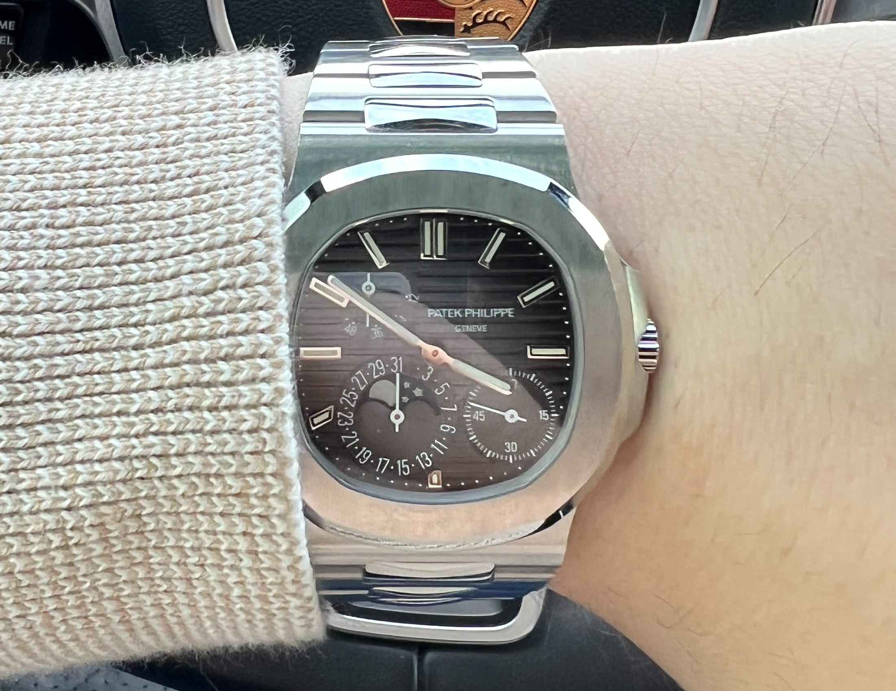

# ⌚ Tempus - Watch Collection Tracking Application

  

## 📌 Project Overview
The **Watch Collection Tracking App** is a **full-stack web application** designed to help registered users create and manage a personal database of their **watch collection**.  

The app integrates with **WatchBase** to fetch **watch specifications** based on the reference number and **WatchCharts** to track **real-time market values**. Users can **add, edit, view, and delete watches**, along with tracking their **portfolio’s value.**  

The application follows the **MEN (MongoDB, Express.js, Node.js) stack** and uses **EJS templates** for rendering the front-end dynamically. The system is built with **session-based authentication**, ensuring that only **authorized users** can access and modify their collection.  

**Future Enhancements** will include **portfolio gain/loss tracking, historical value charts, notifications for price changes, and export features (CSV/PDF).**
