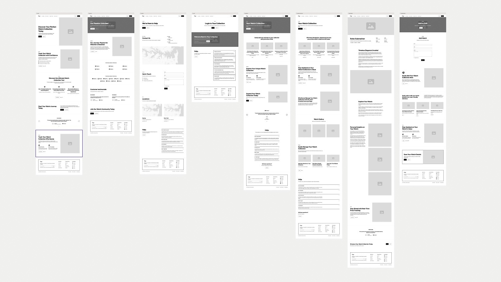
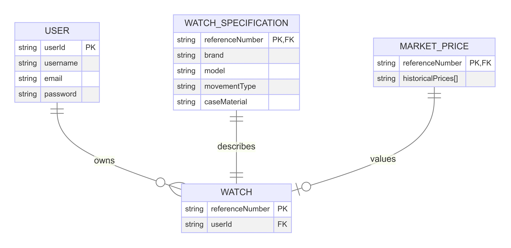

# Tempus - Watch Collection Tracker

#### A watch collection management application for tracking and analyzing timepieces.

## Description
Tempus is a modern watch collection management application designed for horology enthusiasts, collectors, and investors. 
The platform provides users with a structured and organized way to catalog their watch collections, track purchase details, and analyze portfolio value over time. 

Registered users can securely log in and maintain a private database of their timepieces, ensuring their collection remains accessible only to them. 
Each watch entry allows for detailed specifications, including brand, model, reference number, case material, dial color, movement type, and more. 
Users can also document purchase history, noting the original seller, price paid, and whether the watch includes its original box and papers.

The platform is built with aesthetic simplicity and usability in mind, offering a clean, minimalist interface that adapts across devices. 
It features image upload support, allowing collectors to personalize their entries with actual photos of their watches.

While Tempus currently offers manual data entry, future enhancements will include automated integrations for market tracking and watch specification retrieval, making the platform even more powerful for serious collectors.

## Table of Contents
* [Technologies Used](#technologies-used)
* [Features](#features)
* [Design](#design)
* [Wireframe & Planning](#wireframe-planning)
* [Database Schema](#database-schema)
* [Project Next Steps](#next-steps)
* [Deployed App](#deployed-app)
* [About the Author](#about-the-author)

## Technologies Used
* MongoDB
* Express.js
* Node.js
* EJS
* JavaScript
* CSS
* Mongoose (Database Management)

## Features
* Users can **register and authenticate** to maintain a private collection.
* **Add, edit, and delete** watches, including brand, model, reference number, and specifications.
* **Track purchase details**, including price, date, seller, and box/paper availability.
* **Responsive and modern UI**, with intuitive navigation.

## Wireframe & Planning
### [Trello Board](https://trello.com/b/HxeSTFMS/men-stack-crud-app-project-ii)

## Database Schema

* MongoDB is used for storing watch data.
* Schema includes user-linked collections to ensure privacy.

## Project Next Steps
#### Coming Soon Features:
* **Import/export capabilities** via CSV and PDF.
* **API integration** to auto-fill watch details and track real-time market values.
* **User-uploaded images** for watches.
* **Advanced analytics** for portfolio tracking.

## Deployed App
* You can view the repository:
[GitHub Repository](https://github.com/swisswhale/tempus)
* To run locally, clone the repo and follow the setup instructions in the repository.

## About the Author
I build applications and mini projects tied to my various interests. Tempus was created out of my passion for watches and a desire to help collectors manage their portfolios efficiently.
